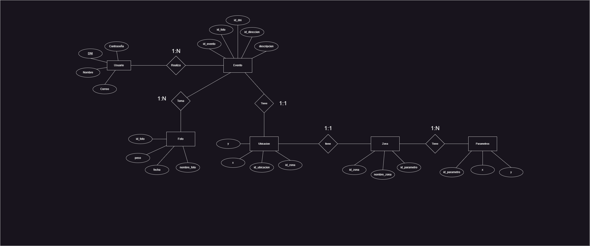

## Tabla de Contenidos:

- [Problemática](#problemática)
- [Aplicaciones Similares](#aplicaciones-similares)
- [Propósito del Proyecto](#propósito-del-proyecto)
- [Tecnologías Usadas](#tecnologías-usadas)
- [Instalación](#instalación)
- [Requisitos y Especificación de Software](#requisitos-y-especificación-de-software)
- [Diagramas](#Diagramas)
- [Mockups](#Mockups)


## Problemática:

En muchas áreas urbanas, la gestión adecuada de la basura se convierte en un desafío significativo. La gente a menudo arroja basura en lugares no autorizados, como calles, parques y áreas naturales, lo que daña el entorno y crea problemas de salud y estéticos.

Además, puede haber ocasiones en las que la recolección de basura por parte de las autoridades no sea oportuna o eficiente, lo que lleva a la acumulación de desechos en áreas públicas.


## Aplicaciones Similares:

- Waze

## Propósito del Proyecto

La aplicación propuesta abordará este problema al proporcionar una plataforma donde los ciudadanos puedan informar fácilmente sobre la presencia de basura en lugares no autorizados.

a) <b>Reporte de Basura en el mapa :</b> En el mapa se podrán visualizar las zonas donde hay basura 

b) <b>Mapa Interactivo , similar al de Waze :</b> este mapa , mapeara , donde se ha reportado basura, haciendo uso del API de Google Map.

c) <b>Tomar fotos para reportar basura:</b> Los usuarios podrán tomar fotos , y subirlas. La ubicación se registrará automáticamente a través de la tecnología de GPS de los dispositivos móviles

## Requisitos

Para que puedan ejecutar siga las siguientes instrucciones:

1. Instalar Node.js

   Descargar e instalar Node.js desde su página oficial: [https://nodejs.org/es/](https://nodejs.org/es/)

## Clonar el repositorio
```
git clone https://github.com/eluqm/CsoftwareGrupo02.git
```
## Ubicarse en la carpeta del proyecto
```
cd CsoftwareGrupo02
```
## Instalar dependencias
```
npm install
```
## Ejecucion Del codigo
```
npx expo start
```

## Requisitos y Especificación de Software

### Requisitos Funcionales

- RF1: El sistema debe permitir a los usuarios observar las zonas con basura en el mapa.
- RF2: El sistema debe permitir a los usuarios reportar basura en el mapa.
- RF3: El sistema debe permitir a los usuarios tomar fotos para reportar basura.
- RF4: El sistema debe registrar automáticamente la ubicación de las fotos mediante GPS.

### Requisitos No Funcionales

- RNF1: El sistema debe ser fácil de usar y entender tanto para los usuarios como para los administradores.
- RNF2: El sistema debe ser seguro y confiable en la gestión de datos de usuarios y reportes de basura.
- RNF3: El sistema debe ser escalable para adaptarse a futuras expansiones y necesidades.
- RNF4: El sistema debe ser compatible con diferentes dispositivos móviles y sistemas operativos.

## Diagramas

### Casos de Uso: Reporte de Basura


### Casos de Uso: Reporte de Basura


### Casos de Uso: Reporte de Basura


### Entidad Relacion 



### Diseños de Caso de Prueba


### Ejecucion de un Caso de Prueba


## Mockups

El proyecto propuesto busca tener una interfaz minimalista, con los mockups se busca diseñar la parte visual del proyecto. Los mockups que se muestra, da una guia de como se vera la interfaz.

### Avance del Proyectos

- Login Movil: EL usuario tendra que iniciar sesión para hacer uso de las funciones que ofrece.


- Interfaz de Inicio: Pantalla de inicio donde tenemos las opciones `Ubucacion Actual` y `Hacer Reporte`.


- Realizar Reporte: El usuario/admistrador podra realizar un reporte, el cual le pedira una `foto` y una `descripcion` para el reporte.


- Visualizar Zonas Reportadas: El usuario/admistrador va poder ver las zonas reportadas en el Mapa.


- Visualizar Informacion del Reporte:  El usuario/admistrador podran ver informacion de las Zona Reportada Señalada.


- Eliminar Reporte: El administrador sera el unico que podra eliminar el Reporte.


